# Assembly Instructions

## Pre-assembly Modifications

**Important:** The following modifications must be completed before assembly.

### Aluminum profiles
- Eight aluminum profiles (400 mm) must be drilled at both ends  
- Two holes per profile (one at each extremity)  
- Hole diameter: 6 mm  
- Maintain a consistent distance *x* from the ends for all profiles  

### Central pillow block
- All mounting holes must be threaded for M4 screws  

---

## Part 1 — Preparation of Aluminum Profiles

### Materials
- 8 × Aluminum profiles (400 mm)  
- 16 × Universal connectors  

### Procedure

1. Insert the connector nut into the T-slot  
   
   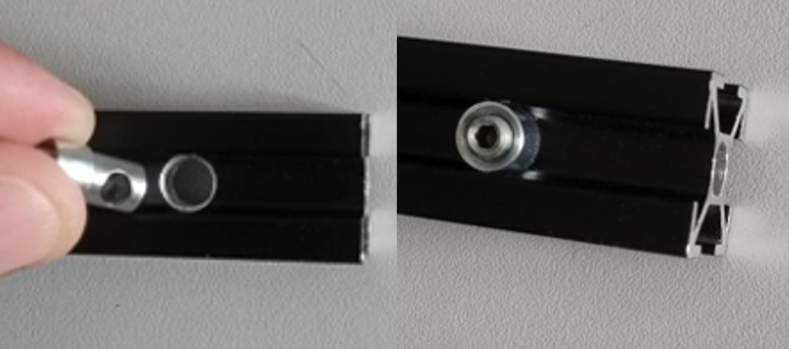

2. Insert the connector screw, keeping it perpendicular  

   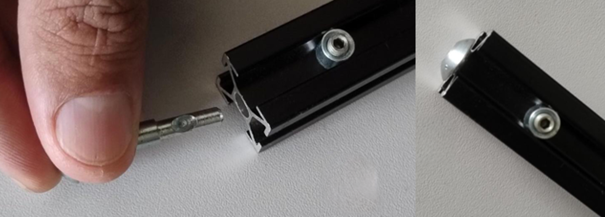

3. Tighten using an Allen key  

   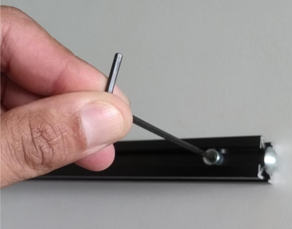

4. Repeat for the opposite end and all profiles  

5. Final prepared profile:  

   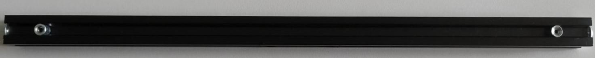

---

## Part 2 — Base Structure Assembly

### Materials
- 4 × Aluminum profiles (500 mm)  
- 8 × Aluminum profiles (400 mm)  

### Procedure

1. Arrange profiles perpendicularly  

   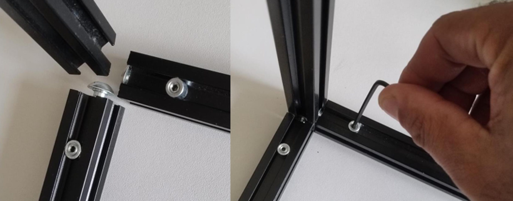

2. Tighten all connections  

   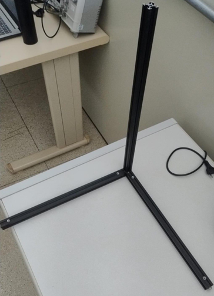

3. Assemble two identical frames  

4. Join both frames into a rectangular base  

5. Fully tighten all fasteners  

   

6. Install upper profiles as end stops (~22.5 cm height)  

   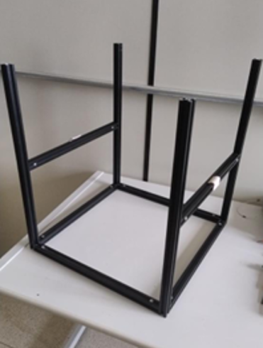

7. Install shaft support profiles  

   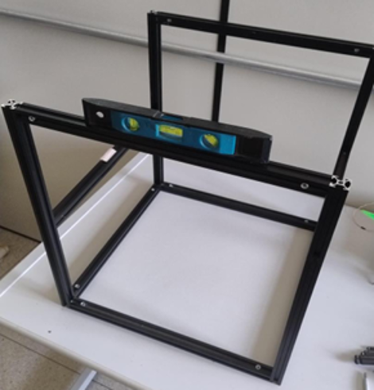

8. Verify alignment and leveling  

   

---

## Part 3 — Rotational Axis and Actuation

### Materials
- 2 × Aluminum profiles (400 mm)  
- 1 × Steel shaft (8 mm × 450 mm)  
- 1 × Shaft coupler  
- 3 × Pillow block components  
- 2 × Bearing supports  
- 2 × Motor mounts  
- Fasteners (M3, M4, M5 + hammer nuts)  

### Procedure

1. Insert shaft into central pillow block  

2. Fix using M4 screws (2 top, 1 bottom)  

   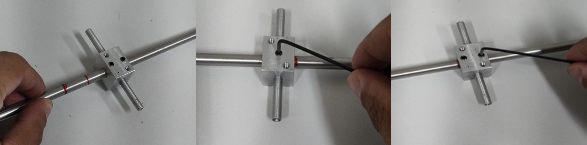

3. Attach locking components  

     
   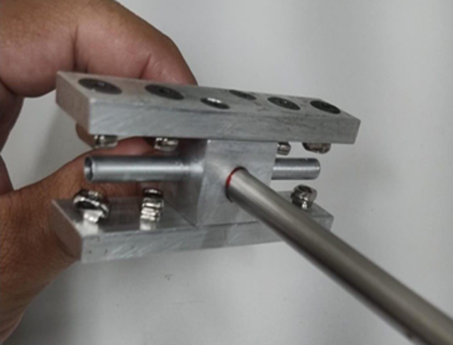

4. Attach aluminum arms  

   

5. Install bearing supports and set spacing  

6. Attach shaft coupler  

   

7. Fix shaft assembly to structure  

   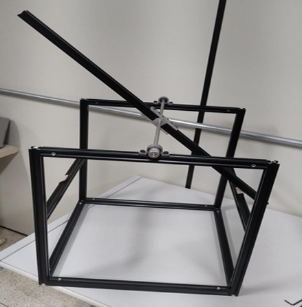

8. Mount motors  

   

9. Attach motors to arms  

   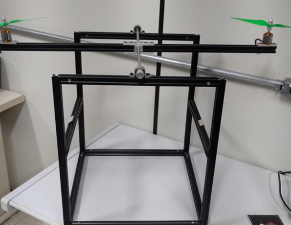

---

## Safety Notes

- Ensure all fasteners are fully tightened before operation  
- Verify structural alignment before powering the system  
- Keep clear of rotating propellers during testing  
- Use appropriate power supply and wiring insulation  

---

  <a href="bom.html">← Previous: Bill of Materials</a>

